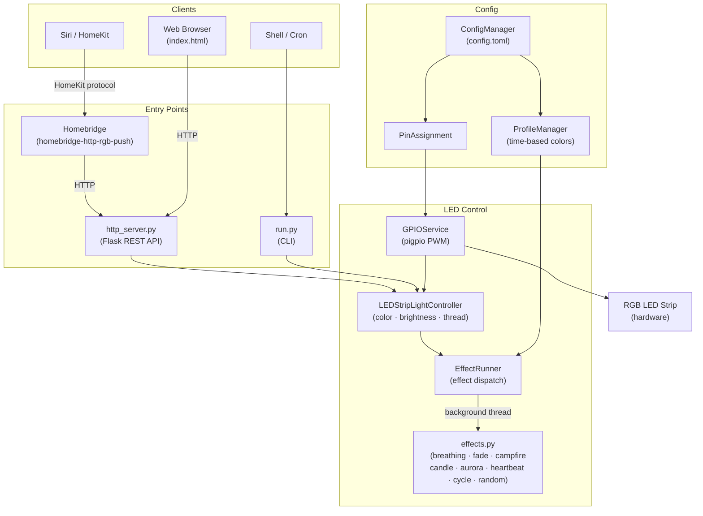

# LED Strip Light


[](https://sonarcloud.io/project/overview?id=janrothen_led-strip-light)
[](https://sonarcloud.io/project/overview?id=janrothen_led-strip-light)
[](https://sonarcloud.io/project/overview?id=janrothen_led-strip-light)
[](https://sonarcloud.io/project/overview?id=janrothen_led-strip-light)
[](https://www.gitguardian.com)

Feature-rich Raspberry Pi project for controlling an RGB LED strip light. Includes:

- Web-based REST API (Flask) for remote control (on/off, color, brightness, effects)
- Web-based interface for manual remote control
- Homebridge integration for Apple HomeKit and Siri voice control
- Command-line interface for scripting and manual control
- Multiple built-in LED effects (breathing, fade, color cycle, random, campfire, candle, aurora, heartbeat, and more)
- Time-based color profiles and scheduled automation (systemd, cron)
- Modular, testable Python codebase with hardware abstraction and full unit test suite

Easily automate, script, or integrate your LED strip with smart home platforms and custom workflows.

## Requirements

**Hardware**
- Raspberry Pi (tested on Pi Zero W Rev 1.1)
- LED strip light

The guide [How to control a RGB LED Strip Light with a Raspberry Pi Zero W](https://janrothen.github.io/led-strip-light/pi-zero-w-rgb-led-strip-control.html) shows how to physically connect a 12 V RGB strip to a Raspberry Pi Zero W.

**Software**
- Python 3.13+
- pip dependencies: `flask`, `pigpio` (see [pyproject.toml](pyproject.toml))

## Architecture



## Installing

Configure the application: [config.toml](src/config.toml)

This project uses the [pigpio](https://abyz.me.uk/rpi/pigpio/download.html) library for PWM control of the GPIO pins. To install it on your Raspberry Pi:
```bash
sudo apt-get install pigpio
sudo systemctl enable pigpiod
sudo systemctl start pigpiod
```

### Pi deployment

```bash
cd ~/raspberry/led-strip-light

# Create venv and install runtime dependencies
python3 -m venv --upgrade-deps .venv
.venv/bin/pip install .

# Install and start the systemd service
sudo cp deploy/systemd/ledstriplight-http-server.service /etc/systemd/system/
sudo systemctl daemon-reload
sudo systemctl enable ledstriplight-http-server.service
sudo systemctl start ledstriplight-http-server.service
```

For full deployment instructions see the READMEs in [`deploy/`](deploy/):
- [`deploy/systemd/`](deploy/systemd/README.md) — systemd service installation and management
- [`deploy/cron/`](deploy/cron/README.md) — scheduled automation with cron
- [`deploy/logrotate.d/`](deploy/logrotate.d/README.md) — log rotation for the cron log
- [`deploy/homebridge/`](deploy/homebridge/README.md) — Apple HomeKit integration

## Development Setup

### Virtual Environment

```bash
# Create and activate virtual environment (from repo root)
python3 -m venv --upgrade-deps .venv
source .venv/bin/activate

# Install dependencies + test extras
pip install -e ".[dev]"
```

### Running the Application
The application supports multiple effects via command-line arguments:

```bash
# Basic profile effect (morning/evening colors based on time of the day)
./run.py profile

# Breathing effect with custom color and duration
./run.py breathing --color red --duration 3000

# Use hex colors
./run.py breathing --color "#FF6347"

# Color cycling through multiple colors
./run.py cycle --colors red,green,blue,yellow --duration 500

# Fade between two colors
./run.py fade --from black --to white --duration 5000

# Random color changes
./run.py random --interval 2000

# Campfire effect (dynamic warm flicker)
./run.py campfire --duration 60000 --base-color "#FF4E04"

# Candle effect (gentler, slower flicker)
./run.py candle --duration 60000

# Aurora drift (slow HSV wander, green↔violet by default)
./run.py aurora --duration 120000

# Heartbeat (double-pulse thump-thump-rest)
./run.py heartbeat --color red

# Get help
./run.py --help
```

### Running Tests
The project includes comprehensive unit tests with hardware mocking. Tests can be run from the repo root (pytest configuration is in `pyproject.toml`):

```bash
# Run all tests (from repo root)
pytest

# Run a specific test file
pytest tests/test_color.py

# Run tests with HTML coverage report
pytest --cov-report=html
```

### Project Structure
```
led-strip-light/
├── deploy/
│   ├── cron/                    # Cron job for scheduled automation
│   ├── homebridge/              # Homebridge config for Apple HomeKit
│   │   ├── armv6/               # Pi Zero W (npm install method)
│   │   └── armv7/               # Pi Zero 2 W (apt install method)
│   ├── logrotate.d/             # Logrotate drop-in for the cron log
│   └── systemd/                 # Systemd service files
├── docs/                        # Documentation and wiring diagrams
├── src/
│   ├── cli/
│   │   └── cli_handler.py       # Command-line interface handler
│   ├── config/
│   │   ├── color_profile.py
│   │   ├── config_manager.py    # Reads config.toml
│   │   └── pin_assignment.py
│   ├── led/
│   │   ├── color.py
│   │   ├── effect_runner.py
│   │   ├── effects.py           # LED effects (breathing, fade, campfire, aurora, …)
│   │   ├── gpio_service.py      # pigpio PWM interface
│   │   ├── led_strip_light_controller.py
│   │   └── profile_manager.py   # Time-based color profiles
│   ├── static/
│   │   └── index.html           # Web UI
│   ├── utils/
│   │   └── graceful_shutdown.py
│   ├── config.toml              # GPIO pins and color profiles
│   ├── http_server.py           # Flask REST API entry point
│   └── run.py                   # CLI entry point
└── tests/                       # Unit tests with mocked hardware
```

## REST API (Flask Server)

The project includes a Flask server for remote control via HTTP endpoints and a web-based control interface.

### Web Interface

A responsive web interface is available for controlling the LED strip through your browser:

- **Access:** Navigate to `http://localhost:5000` (or `http://YOUR_PI_IP:5000` from other devices)
- **Features:**
  - Power control (On/Off) with visual status indicators
  - Color picker and preset color buttons (Red, Green, Blue, White, Yellow, Magenta, Cyan)
  - Brightness slider with real-time adjustment
  - Start/stop built‑in effects (breathing, campfire, candle, aurora, heartbeat, random, cycle, fade) with parameter inputs
  - Live status + active effect display and error handling
  - Mobile-friendly responsive design

### API Endpoints

**Endpoints:**

Core control:
* `POST /on` — Turn the light on (white)
* `POST /off` — Turn the light off (black)
* `GET /status` — Get on/off state (1/0)
* `GET /color` — Get current color (hex with #)
* `POST /color/<value>` — Set color (6‑digit hex, with or without #)
* `GET /brightness` — Get current brightness (0–100)
* `POST /brightness/<int:value>` — Set brightness (0–100)

Effects management:
* `GET /effects` — List available effects + currently active
* `POST /effects/stop` — Stop any running effect
* `POST /effects/breathing` JSON: `{ "color": "FF0000", "duration": 2000 }`
* `POST /effects/campfire` (optional JSON overrides: duration, update_hz, min_brightness, max_brightness, hue_jitter, saturation, spark_chance, spark_gain, tau_ms, gamma)
* `POST /effects/candle` (same override keys as campfire)
* `POST /effects/aurora` (optional JSON overrides: duration, update_hz, hue_min, hue_max, saturation, min_brightness, max_brightness, hue_step, brightness_step, tau_ms, gamma)
* `POST /effects/heartbeat` (optional JSON overrides: color, beat_ms, gap_ms, rest_ms, second_beat_scale)
* `POST /effects/random` JSON: `{ "interval": 2000 }`
* `POST /effects/cycle` JSON: `{ "duration": 2000, "colors": ["FF0000","00FF00","0000FF"] }`
* `POST /effects/fade` JSON: `{ "from": "000000", "to": "FFFFFF", "duration": 5000 }`
* `POST /effects/profile` JSON: `{ "duration": 10000 }` (fades from black to active profile color)

**Starting the server:**
```bash
cd src
./http_server.py
```

Example usage:
```bash
curl -X POST http://localhost:5000/on
curl -X POST http://localhost:5000/color/ff0000
curl -X POST http://localhost:5000/brightness/80
curl http://localhost:5000/status

# Start campfire effect
curl -X POST http://localhost:5000/effects/campfire

# Start candle effect for 30s
curl -X POST -H 'Content-Type: application/json' \
  -d '{"duration":30000}' http://localhost:5000/effects/candle

# Start aurora drift with a narrower hue range (teal→violet)
curl -X POST -H 'Content-Type: application/json' \
  -d '{"hue_min":0.45,"hue_max":0.78,"tau_ms":3000}' \
  http://localhost:5000/effects/aurora

# Heartbeat in pink with a softer second beat
curl -X POST -H 'Content-Type: application/json' \
  -d '{"color":"FF69B4","second_beat_scale":0.5}' \
  http://localhost:5000/effects/heartbeat

# Breathing effect: blue, 3s cycles
curl -X POST -H 'Content-Type: application/json' \
  -d '{"color":"0000FF","duration":3000}' http://localhost:5000/effects/breathing

# Custom cycle effect
curl -X POST -H 'Content-Type: application/json' \
  -d '{"colors":["FF0000","00FF00","0000FF","FFFF00"],"duration":800}' http://localhost:5000/effects/cycle

# Fade from black to warm white over 10s
curl -X POST -H 'Content-Type: application/json' \
  -d '{"from":"000000","to":"FFC864","duration":10000}' http://localhost:5000/effects/fade

# Run current time-based profile color (10s fade in)
curl -X POST -H 'Content-Type: application/json' \
  -d '{"duration":12000}' http://localhost:5000/effects/profile

# Stop current effect
curl -X POST http://localhost:5000/effects/stop
```

## Homebridge Integration

You can integrate the LED strip with Homebridge for Apple HomeKit support. All installation and configuration instructions, including example Homebridge accessory configuration, can be found in the `deploy/homebridge/` directory of this repository.

See [`README.md`](deploy/homebridge/README.md) for details on how to set up Homebridge integration and connect it to the Flask server endpoints.

## Contributing

Found a bug or have an idea? Open an issue or send a PR.
Run `pytest` before submitting and keep changes focused.

## License

MIT © Jan Rothen — see [LICENSE](LICENSE) for details.
