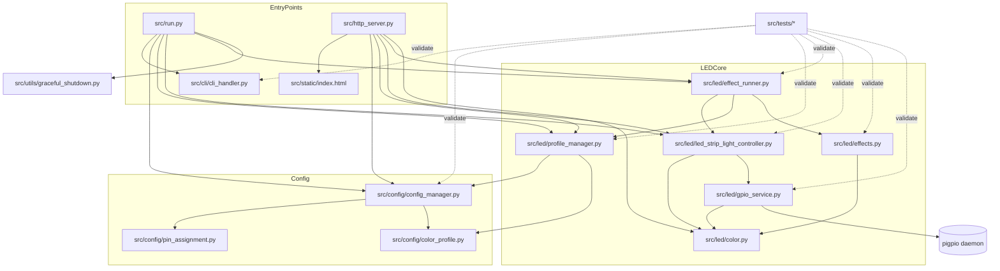

# Codebase Diagram

```mermaid
flowchart TD
    subgraph EntryPoints
        RUN["src/run.py"]
        HTTP["src/http_server.py"]
        CLI["src/cli/cli_handler.py"]
        WEB["src/static/index.html"]
    end

    subgraph Config
        CFG["src/config/config_manager.py"]
        PINS["src/config/pin_assignment.py"]
        CPROF["src/config/color_profile.py"]
    end

    subgraph LEDCore
        PM["src/led/profile_manager.py"]
        ER["src/led/effect_runner.py"]
        CTRL["src/led/led_strip_light_controller.py"]
        EFX["src/led/effects.py"]
        GPIO["src/led/gpio_service.py"]
        COLOR["src/led/color.py"]
    end

    SHUT["src/utils/graceful_shutdown.py"]
    TESTS["src/tests/*"]
    PIGPIO[("pigpio daemon")]

    RUN --> CLI
    RUN --> CFG
    RUN --> PM
    RUN --> CTRL
    RUN --> ER
    RUN --> SHUT

    HTTP --> WEB
    HTTP --> CFG
    HTTP --> PM
    HTTP --> CTRL
    HTTP --> ER
    HTTP --> COLOR

    CFG --> PINS
    CFG --> CPROF
    PM --> CFG
    PM --> CPROF

    ER --> CTRL
    ER --> PM
    ER --> EFX
    EFX --> COLOR
    CTRL --> COLOR
    CTRL --> GPIO
    GPIO --> COLOR
    GPIO --> PIGPIO

    TESTS -. validate .-> CLI
    TESTS -. validate .-> CFG
    TESTS -. validate .-> PM
    TESTS -. validate .-> ER
    TESTS -. validate .-> CTRL
    TESTS -. validate .-> EFX
    TESTS -. validate .-> GPIO
```
